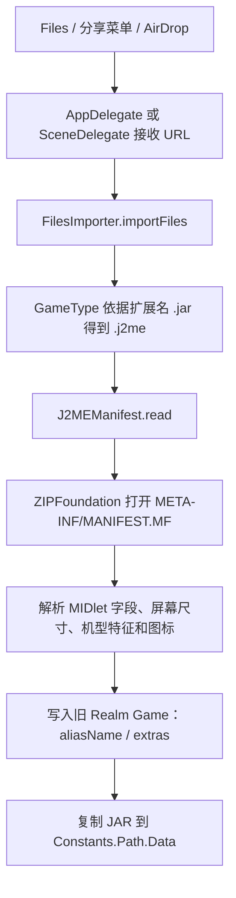
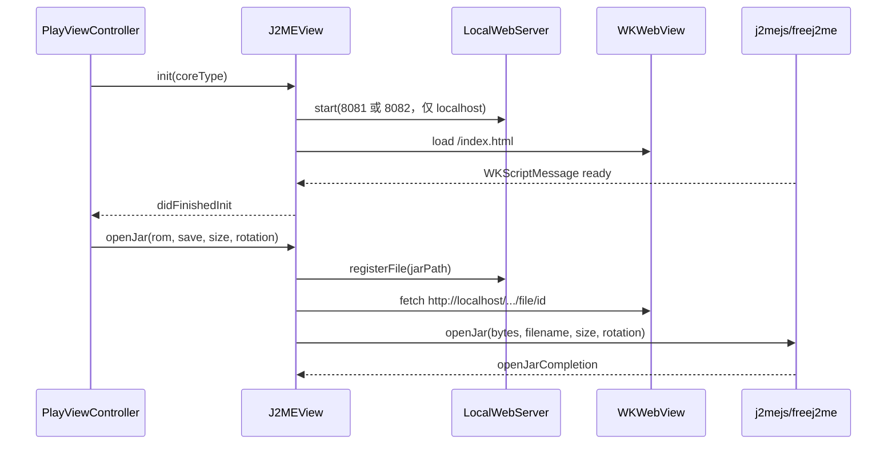
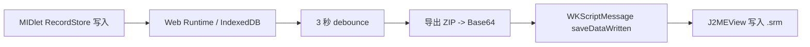
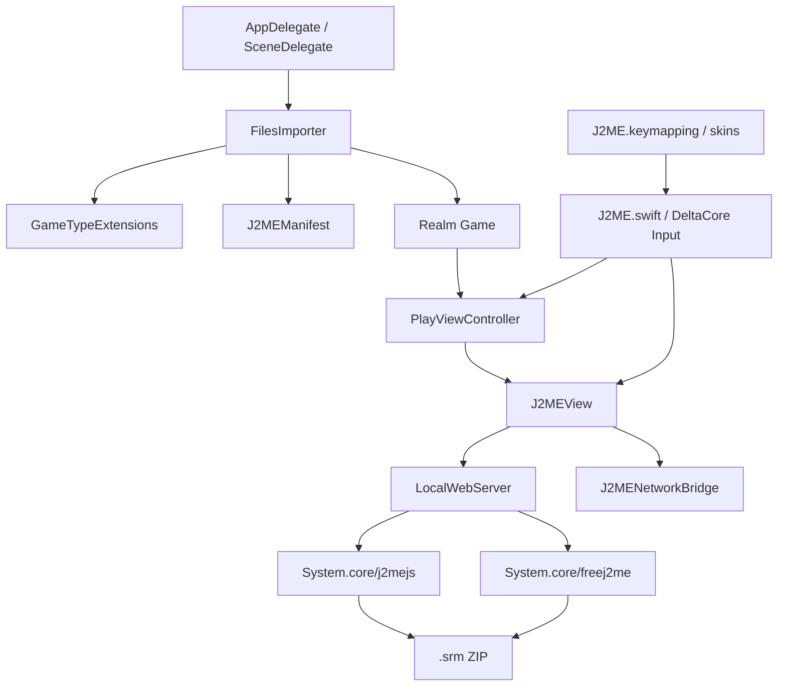

# ManicEMU J2ME 架构分析

> 分析基线：`ios` 分支，提交 `5a4fb7e8`。本文件只描述现有实现和后续 JavaPocket 裁剪边界，不改变运行代码。

## 1. 结论摘要

ManicEMU 的 J2ME 不是传统原生 libretro Core，而是 **Swift/UIKit 宿主 + 本机 HTTP 服务 + WKWebView + JavaScript/Java ME 运行时**：

- Swift 负责 JAR 导入、Manifest 解析、游戏模型、WebView 生命周期、输入、音频、截图和存档文件落盘。
- `LocalWebServer` 将随 App 打包的 Web 运行时和用户导入的 JAR 暴露到仅绑定 localhost 的端口。
- `J2MEView` 在 `WKWebView` 内启动 `j2mejs` 或 `freej2me`，通过 JavaScript API 与 `WKScriptMessageHandler` 双向通信。
- `J2MENetworkBridge` 只服务 `j2mejs`，把 JavaScript 的 HTTP/TCP 请求转成 iOS `URLSession`/`Network.framework` 请求。
- RMS 数据由 Web 运行时导出为 ZIP/Base64，再由 Swift 写入 `.srm`；运行时也会通过 `saveDataWritten` 主动触发自动保存。

JavaPocket 可以保留这条链路，同时完全隔离 Nintendo、PlayStation、Sega、Arcade、DOS 和各原生模拟器 Core。旧的 `Game`/Realm/皮肤/PlayViewController 体系耦合很深，适合保留作参考而不是继续作为新首页和新数据层。

## 2. 当前工程结构

```text
ManicEmu/
├─ ManicEmu.xcodeproj/                  Xcode 工程、iOS/tvOS targets、SwiftPM 依赖
└─ ManicEmu/
   ├─ Resources/                        Info.plist、Assets、Localization、xcconfig
   └─ Sources/
      ├─ Base/                          AppDelegate、SceneDelegate、常量与启动逻辑
      ├─ Business/
      │  ├─ Common/Views/               J2MEView、J2MENetworkBridge
      │  ├─ Import/                     导入 UI
      │  ├─ Games/                      旧游戏库 UI
      │  ├─ GameInfo/                   详情和 J2ME 设置
      │  ├─ Controllers/                外接/触控输入映射
      │  └─ Play/                       Game 模型、PlayViewController、皮肤
      └─ Tools/
         ├─ Cores/J2ME.swift            DeltaCore 输入声明和桥接
         ├─ Extensions/                 文件类型、GameType、Core 映射
         └─ Others/                     FilesImporter、Database、LocalWebServer

System.core/
├─ freej2me/                            FreeJ2ME Web/CheerpJ 运行时
├─ j2mejs/                              j2me.js Web 运行时
├─ J2ME.keymapping                      外接手柄到 J2ME 按键的默认映射
├─ J2ME.manicskin                       旧固定皮肤（Git LFS）
└─ J2ME_FLEX.manicskin                  旧可伸缩皮肤（Git LFS）
```

## 3. J2ME 关键文件与职责

| 文件/目录 | 职责 | 直接依赖 |
|---|---|---|
| `Sources/Tools/Cores/J2ME.swift` | 声明 `.j2me` GameType、20 个 J2ME 输入、DeltaCore 描述；把统一输入转发给当前 `J2MEView` | DeltaCore、`PlayViewController.j2meView` |
| `Sources/Business/Common/Views/J2MEView.swift` | Manifest/JAR 解析、WKWebView、运行时启动、输入、音频、速度、暂停、截图、RMS/即时存档 | WebKit、ZIPFoundation、SnapKit、`LocalWebServer`、`J2MENetworkBridge` |
| `Sources/Business/Common/Views/J2MENetworkBridge.swift` | `evalNative` 网络桥；HTTP、TCP socket、回调注入 | WebKit、Network.framework |
| `Sources/Tools/Others/LocalWebServer.swift` | 以 `8081`/`8082` 服务 j2mejs/freej2me 静态资源及注册后的 JAR | GCDWebServer、`Constants.Path` |
| `Sources/Business/GameInfo/VIews/J2MESettingView.swift` | 旧 UI 中手动设置分辨率与旋转 | `Game` extras、`J2MEView.reset` |
| `Sources/Tools/Others/FilesImporter.swift` | 文件选择后的统一导入；`.jar` 映射为 J2ME，并读取 Manifest 设置别名/分辨率 | Realm、`GameType`、`J2MEManifest` |
| `Sources/Tools/Extensions/GameTypeExtensions.swift` | `.jar -> .j2me`、名称、厂商分组、可选 Core (`J2meJS`/`freej2me`) | 全部平台枚举和 Core 注册表 |
| `Sources/Business/Play/Models/Game.swift` | 旧 Realm Game 数据、ROM 路径、J2ME `.srm` 路径、屏幕设置、删除两套 Core 存档 | Realm、IceCream、全部平台代码 |
| `Sources/Business/Play/VIewControllers/PlayViewController.swift` | 创建 `J2MEView`、打开 JAR、连接皮肤/外设输入、暂停恢复、音频、速度和退出 | 大部分 ManicEMU 业务模块 |
| `Sources/Tools/Others/Database.swift` | 修复旧版本 j2mejs RecordStore ZIP 内部路径 | Realm、ZIPFoundation |
| `System.core/freej2me/` | FreeJ2ME Java 运行时、CheerpJ 加载、Canvas、输入、RMS 导入导出 | 在线 CheerpJ 运行时；部分 WASM 为 Git LFS |
| `System.core/j2mejs/` | JavaScript JVM/MIDP 实现、Canvas、媒体、RMS/IndexedDB、iOS 注入 API | `java/classes.jar`（Git LFS） |
| `System.core/J2ME.keymapping` | GameController A/B/X/Y、方向、摇杆、肩键到 fire/方向/SoftKey 的默认映射 | DeltaCore Input 标识 |
| `Resources/Info.plist` | 声明 `public.aoshuang.game.j2me` 和 `.jar` 文档类型，接收 Files/分享/AirDrop | App/Scene URL 打开流程 |

## 4. 当前运行流程

### 4.1 JAR 导入



`J2MEManifest.read(from:)` 当前读取/推导：

- `MIDlet-Name`、`MIDlet-Version`、`MIDlet-Vendor`
- `MIDlet-Description`、`MIDlet-Info-URL`
- `MIDlet-1` 的显示名、图标路径和主类
- `MicroEdition-Profile`、`MicroEdition-Configuration`
- `Nokia-MIDlet-Canvas-Size` 等多个分辨率字段
- 文件名中的 `NNNxNNN` 兜底分辨率
- Nokia Manifest 标记、Siemens/Sony Ericsson class signature
- JAR 内图标二进制

旧流程只把显示名和屏幕尺寸写入 `Game`；厂商、版本、MIDP/CLDC、图标并未完整持久化，这是 JavaPocket `GameRecord` 要补齐的部分。

### 4.2 启动游戏



- `j2mejs` 使用 `window.j2me`/`window.j2meAPI`。
- `freej2me` 使用 `window.freej2meAPI`；为满足 CheerpJ 限制，在 Java 主程序启动前导入存档。
- 分辨率和旋转在启动脚本中先设置，避免 MIDlet `startApp()` 后再改变 Canvas。

### 4.3 输入调用链

```text
旧触屏皮肤 / MFi GameController
  -> DeltaCore Input(J2MEGameInput)
  -> J2MEEmulatorBridge.activate/deactivateInput
  -> PlayViewController.j2meView
  -> J2MEView.pressButton
  -> WKWebView evaluateJavaScript
  -> window.Input.keyDown/keyUp
  -> MIDP/FreeJ2ME key event
```

按键编码：方向键 `Arrow*`，确认 `Enter`，数字 `Digit0...9`，`*`/`#` 使用 `KeyE`/`KeyR`，左右软键使用 `F1`/`F2`。`J2MEView` 对 j2mejs 维护按下中的按键，避免重复 key-down。

### 4.4 网络调用链

仅 j2mejs 使用：

```text
Java ME 网络 API
  -> j2mejs evalNative
  -> window.webkit.messageHandlers.j2me(type: evalNative)
  -> J2MEView
  -> J2MENetworkBridge
  -> URLSession 或 NWConnection
  -> JavaScript 回调/Socket 事件注入
```

支持 HTTP 请求、TCP connect/on/invoke、收包、断开和清理。freej2me 自行处理网络，不创建此桥。

### 4.5 RMS 与自动保存



- 手动保存：`J2MEView.save(to:)` 调用运行时 `getSaveData()`，最长等待 15 秒。
- 自动保存：运行时 RecordStore 同步后发 `saveDataWritten`，Swift 直接覆盖 `savePath`。
- 载入：j2mejs 可通过 API 载入；freej2me 必须在 Java 代码运行前把 Base64 交给 `openJar`。
- 即时存档：`exportSaveState`/`importSaveState` 走独立消息；j2mejs 导入后重启。
- 旧存档命名：`Data/<game>.<J2meJS|freej2me>.srm`。
- `Database.fixJ2meJSSave` 修复早期 ZIP 中 `RecordStore_game.0` 到带 JAR 文件名的新路径。

JavaPocket 目标结构应改为：

```text
Documents/Games/<game-id>/
├─ game.jar
├─ metadata.json
├─ icon.png
└─ save/
   ├─ rms.zip
   └─ controller-layout.json
```

## 5. 文件关系图



## 6. JavaPocket 裁剪边界

### 6.1 必须保留或迁移

**运行引擎**

- `System.core/freej2me/**`
- `System.core/j2mejs/**`（若无法取得 `classes.jar` LFS 对象，则默认使用 freej2me，并把 j2mejs 标记为可选引擎）
- `J2MEView.swift` 的 WebView、脚本消息、输入、音频、暂停、尺寸、RMS 逻辑
- `J2MENetworkBridge.swift`
- `LocalWebServer.swift` 中 J2ME 两种 server type

**导入与元数据**

- `J2MEManifest` 解析能力
- `.jar` UTType / Document Type
- Files、分享菜单、AirDrop 的 URL 接收
- ZIPFoundation（当前 Manifest/JAR 解析的唯一必要第三方库）

**输入和存档**

- `J2MEButton` 和按键编码
- `J2ME.keymapping` 的外设语义（新 SwiftUI 虚拟键盘不依赖旧 skin）
- RMS 导入、导出、自动保存和旧存档迁移算法

**App 基础**

- SwiftUI/UIKit、WebKit、Network、AVFoundation 等 Apple frameworks
- 现有 Xcode 工程与签名/构建配置作为承载，不重新创建仓库

### 6.2 可删除或从 JavaPocket target 隔离，不影响 J2ME

- `Cores/**` 全部原生模拟器 frameworks（Citra、Libretro 及各平台 Core）
- `Dependencies/Libretro`
- `System.core/Libretro/**`
- Nintendo/PlayStation/Sega/Atari/Arcade/DOS/3DS 对应 Core Swift 文件、BIOS、shader、皮肤、数据库和 UI
- RetroAchievements、OnlinePlay、Pretendo/Nimbus、MAME、ROM Patcher、Cheat、Shader、BIOS 管理
- tvOS target（JavaPocket 第一版只做 iOS）
- 旧主机分类、厂商分类、平台排序 UI
- 旧购买页、主题页、ManicEMU 品牌推广资源

这些文件可以继续留在仓库历史中，但不应出现在 JavaPocket target 的 Sources/Resources/Frameworks/Embed Frameworks 阶段。

### 6.3 需要修改或替换

| 现有位置 | JavaPocket 改动 |
|---|---|
| Xcode target/build settings | Product/Module/Bundle ID 改为 JavaPocket / `com.javapocket.emulator`；只链接 J2ME 所需依赖 |
| `Info.plist` | 只保留 `.jar` 文档类型、文件共享和必要权限；App 名改为 JavaPocket |
| App/Scene 启动 | 入口改为 SwiftUI `JavaPocketApp`/`JavaPocketRootView`，处理 `onOpenURL` |
| 旧 Realm `Game` | 用独立 Codable `GameRecord` 替代，持久化 `metadata.json` |
| `FilesImporter` | 收敛为只接受单个/多个 `.jar`；创建 `Documents/Games/<id>` 原子目录 |
| `J2MEManifest` | 持久化厂商、版本、MIDP、CLDC、图标、主类、分辨率；增强大小/编码/坏包错误处理 |
| `J2MEView` | 去除 `BaseView`、SnapKit、`GameSetting`、`Constants`、`Log` 依赖，变成独立 UIKit 组件供 SwiftUI 包装 |
| `LocalWebServer` | 仅保留 J2ME；资源路径由 JavaPocket Bundle 注入；端口冲突时可重试 |
| `J2ME.swift` | 不再依赖 DeltaCore/PlayViewController 单例；输入直接绑定当前 Player Session |
| `PlayViewController` | 用 `PlayerView` + `UIViewRepresentable` 替换 |
| 旧 skins | 用 SwiftUI Nokia 键盘、摇杆、自定义布局替代 |
| `.srm` 路径 | 迁移到每游戏 `save/rms.zip`；退出/后台时强制保存，写入采用原子替换 |

## 7. 风险与已发现问题

1. **Git LFS 配额耗尽**：当前 clone 缺失 J2ME 两套 `.manicskin`、j2mejs `classes.jar` 和 freej2me 的两个媒体 WASM；远端返回 LFS budget exceeded。新 UI 不依赖旧 skin，freej2me 主 JAR 当前存在；j2mejs 在补齐 `classes.jar` 前不可作为可靠默认引擎。
2. **freej2me 的 CheerpJ 在线依赖**：首次启动需要联网加载运行时，冷启动时间可能较长。
3. **Manifest 编码**：现实现只接受 UTF-8；旧 Nokia/Sony Ericsson JAR 可能使用其他编码，需要回退 ISO-8859-1/Windows-1252。
4. **图标失败会使 Manifest 解析失败**：现实现对声明了但不存在的 icon 直接返回 `nil`，应改为仅忽略图标。
5. **端口固定**：8081/8082 冲突时没有回退策略。
6. **JavaScript 字符串转义**：文件名直接插入 JS 字符串，包含引号/反斜线时有风险，应通过 JSON 编码参数。
7. **自动保存非原子写入**：现实现 `Data.write` 未启用 `.atomic`，异常退出可能损坏存档。
8. **旧模型强耦合**：`Game.swift` 引用了 Realm、IceCream、Citra 和全部平台逻辑，不适合纯 J2ME target。

## 8. 推荐迁移顺序

1. 在现有 Xcode 工程内新增独立 JavaPocket iOS target，先不删除历史文件。
2. 新建 `JavaPocket/Sources/{App,Library,Import,Player,Controller,Emulator,Storage}`。
3. 迁移并去耦 Manifest、WebView、LocalWebServer、NetworkBridge。
4. 先实现 Codable 文件库和 `.jar` 导入，再接入播放器。
5. 完成 Nokia/摇杆/自定义控制器与 RMS 生命周期保存。
6. CI 在 macOS 上验证 JavaPocket target；确认后再删除或归档旧非 J2ME assets。

